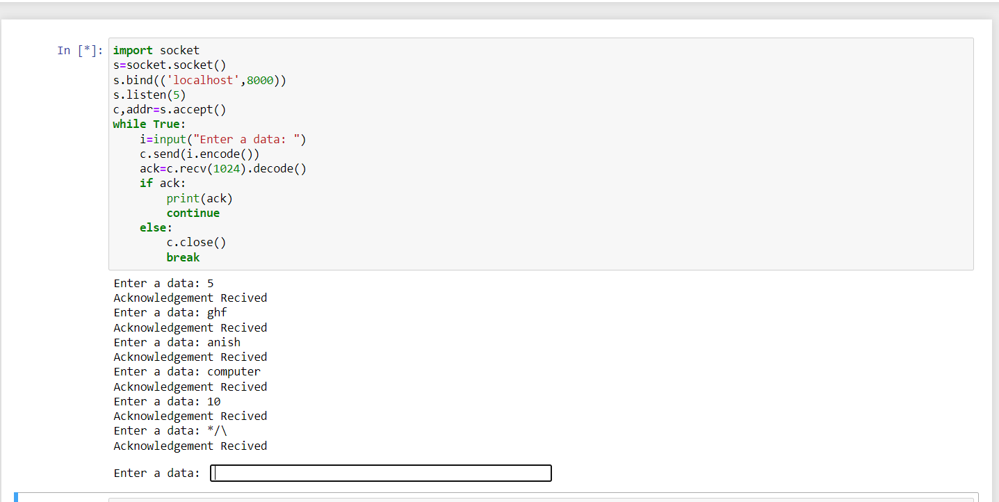

# EX-2 IMPLEMENTATION OF STOP AND WAIT PROTOCOL

##  DATE:13-03-2023

# AIM :
To write a python program to perform stop and wait protocol

# ALGORITHM :
1. Start the program.
2. Get the frame size from the user
3. To create the frame based on the user request.
4. To send frames to server from the client side.
5. If your frames reach the server it will send ACK signal to client
otherwise it will sendNACK signal to client.
6. Stop the program

# PROGRAM :
## CLIENT
~~~
import socket
s=socket.socket()
s.bind(('localhost',8000))
s.listen(5)
c,addr=s.accept()
while True:
    i=input("Enter a data: ")
    c.send(i.encode())
    ack=c.recv(1024).decode()
    if ack:
        print(ack)
        continue
    else:
        c.close()
        break
~~~
## SERVER
~~~
import socket
s=socket.socket()
s.connect(('localhost',8000))
while True:
    print(s.recv(1024).decode())
    s.send("Acknowledgement Recived".encode())
~~~

# OUTPUT :
## CLIENT 

## SERVER

## RESULT :
Thus, python program to perform stop and wait protocol was successfully executed.

